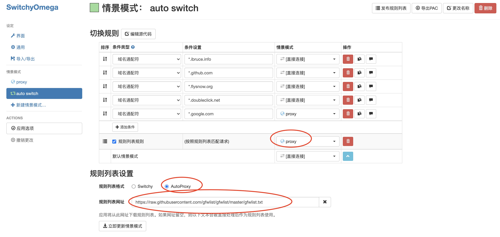
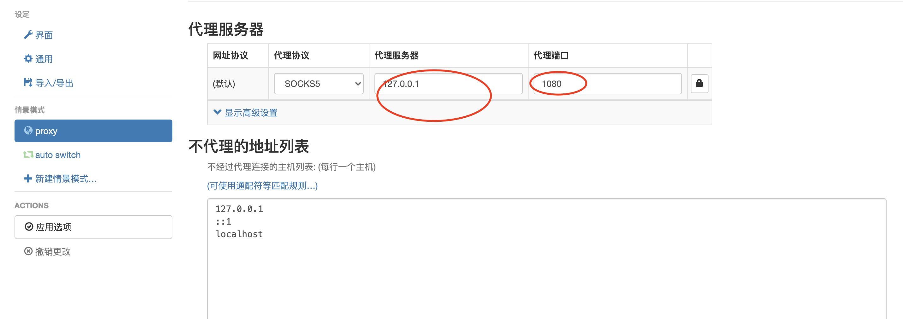

### 科学上网服务端搭建

```
1. 基于ubuntu 18.04
2. 目前已搭建好，如果仅仅使用的话不需要关注这个服务端是符合搭建的
3. 最好不要通过翻墙下载大流量文件资源
```

+ 登录vps

+ curl -O https://raw.githubusercontent.com/v2fly/fhs-install-v2ray/master/install-release.sh

+ chmod +x install-release.sh

+ ./install-release.sh

+ 修改配置文件 [id和port可以自定义]
```
{
  "inbounds": [{
    "port": 10086,
    "protocol": "vmess",
    "settings": {
      "clients": [{ "id": "b831381d-6324-4d53-ad4f-8cda48b30811" }]
    }
  }],
  "outbounds": [{
    "protocol": "freedom",
    "settings": {}
  }]
}
```

+ systemctl enable v2ray

+ systemctl start v2ray

------

### 客户端使用 STEP 1

+ MAC安装客户端

```
1. brew tap v2ray/v2ray

2. brew install v2ray-core

3. vim /usr/local/etc/v2ray/config.json

{
  "inbounds": [{
    "port": 1080,  // SOCKS 代理端口，在浏览器中需配置代理并指向这个端口
    "listen": "127.0.0.1",
    "protocol": "socks",
    "settings": {
      "udp": true
    }
  }],
  "outbounds": [{
    "protocol": "vmess",
    "settings": {
      "vnext": [{
        "address": "108.160.141.223", // 服务器地址，请修改为你自己的服务器 ip 或域名
        "port": 10086,  // 服务器端口
        "users": [{ "id": "b831381d-6324-4d53-ad4f-8cda48b30811" }]
      }]
    }
  },{
    "protocol": "freedom",
    "tag": "direct",
    "settings": {}
  }],
  "routing": {
    "domainStrategy": "IPOnDemand",
    "rules": [{
      "type": "field",
      "ip": ["geoip:private"],
      "outboundTag": "direct"
    }]
  }
}

4. brew services start v2ray-core

```

+ WINDOWS客户端直接解压v2ray-windows-64.zip即可

-----

### 客户端使用 STEP 2

+ 推荐chrome安装插件switchyomega
```
直接拖动插件到chrome的扩展区即可安装代理插件
SwitchyOmega-Chromium-2.5.15.crx：适合chrome和firfox
SwitchyOmega_Chromium-2.5.20.crx: 适合chrome
```

+ 设置过滤规则 

+ 设置proxy 

+ 使用